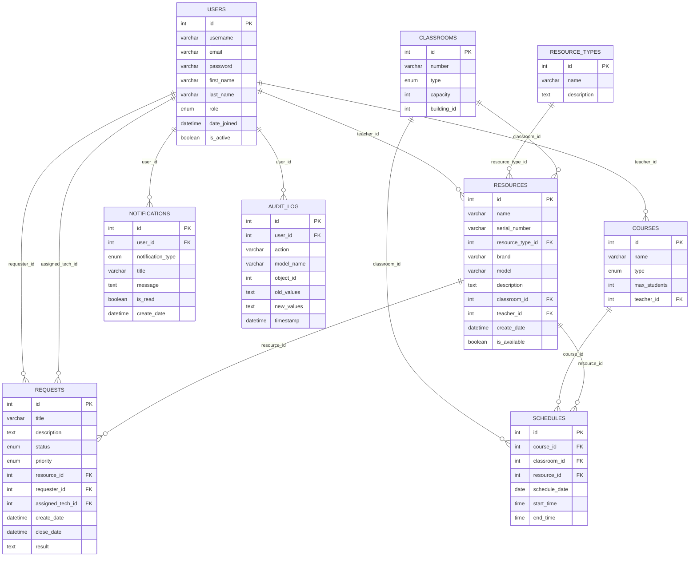
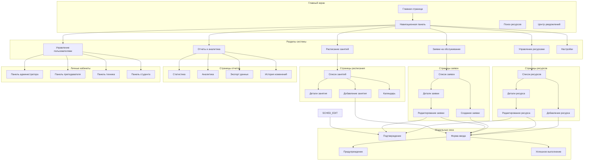

# ДИАГРАММЫ СИСТЕМЫ УПРАВЛЕНИЯ УЧЕБНЫМИ РЕСУРСАМИ

## Рисунок 1 – Диаграмма прецедентов (Use Case Diagram)

```mermaid
graph TD
    A[Система управления учебными ресурсами] --> B[Администратор]
    A --> C[Преподаватель]
    A --> D[Технический специалист]
    A --> E[Студент]
    
    %% Администраторские функции
    B --> F1[Управление пользователями]
    B --> F2[Управление ресурсами]
    B --> F3[Управление кабинетами]
    B --> F4[Просмотр отчетов]
    B --> F5[Резервное копирование]
    B --> F6[Просмотр логов]
    
    %% Функции преподавателя
    C --> F7[Просмотр доступных ресурсов]
    C --> F8[Создание заявок на обслуживание]
    C --> F9[Бронирование ресурсов]
    C --> F10[Просмотр своих заявок]
    C --> F11[Управление курсами]
    C --> F12[Просмотр расписания]
    
    %% Функции технического специалиста
    D --> F13[Обработка заявок]
    D --> F14[Регистрация перемещений]
    D --> F15[Фиксация ремонтов]
    D --> F16[Просмотр нагрузки]
    D --> F17[Управление статусами]
    
    %% Функции студента
    E --> F18[Просмотр доступных ресурсов]
    E --> F19[Просмотр расписания]
    E --> F20[Поиск учебных материалов]
    
    %% Общие функции
    A --> G1[Авторизация]
    A --> G2[Просмотр уведомлений]
    A --> G3[Чат поддержки]
    A --> G4[Поиск ресурсов]
    
    %% Связи между функциями
    F8 --> F13
    F9 --> F7
    F10 --> F2
    F15 --> F4
    F17 --> F10
```

## Рисунок 2 – Функциональная схема

```mermaid
graph TB
    subgraph "Пользовательский интерфейс"
        UI1[Веб-интерфейс]
        UI2[Мобильный интерфейс]
    end
    
    subgraph "Контроллеры (Views)"
        V1[AccountController]
        V2[ResourceController]
        V3[RequestController]
        V4[ScheduleController]
        V5[ReportController]
        V6[NotificationController]
    end
    
    subgraph "Модели данных"
        M1[User Model]
        M2[Resource Model]
        M3[Request Model]
        M4[Schedule Model]
        M5[Classroom Model]
        M6[Course Model]
        M7[Notification Model]
    end
    
    subgraph "Бизнес-логика"
        BL1[Управление доступом]
        BL2[Валидация данных]
        BL3[Уведомления]
        BL4[Формирование отчетов]
        BL5[Резервное копирование]
    end
    
    subgraph "Уровень данных"
        DB[(PostgreSQL)]
        CACHE[(Redis Cache)]
        FILES[(Файловое хранилище)]
    end
    
    subgraph "Внешние сервисы"
        EMAIL[Email сервис]
        SMS[SMS сервис]
        BACKUP[Сервис бэкапов]
    end
    
    %% Связи
    UI1 --> V1
    UI1 --> V2
    UI1 --> V3
    UI1 --> V4
    UI1 --> V5
    UI1 --> V6
    
    UI2 --> V1
    UI2 --> V2
    UI2 --> V3
    
    V1 --> M1
    V1 --> BL1
    V2 --> M2
    V2 --> M5
    V2 --> BL2
    V3 --> M3
    V3 --> BL3
    V4 --> M4
    V4 --> M6
    V5 --> BL4
    V6 --> M7
    V6 --> BL3
    
    BL1 --> DB
    BL2 --> DB
    BL3 --> EMAIL
    BL3 --> SMS
    BL4 --> DB
    BL5 --> BACKUP
    
    M1 --> DB
    M2 --> DB
    M3 --> DB
    M4 --> DB
    M5 --> DB
    M6 --> DB
    M7 --> DB
    
    V1 --> CACHE
    V2 --> CACHE
    V3 --> CACHE
    
    V5 --> FILES
    BL5 --> FILES
```

## Рисунок 7 – ERD-модель базы данных

## Рисунок 8 – Схема пользовательского интерфейса

## Описание диаграмм

### Диаграмма прецедентов
Показывает функциональные требования системы с точки зрения пользователей. Включает 4 типа пользователей (администратор, преподаватель, технический специалист, студент) и их основные действия в системе.

### Функциональная схема
Отображает архитектуру системы с разделением на пользовательский интерфейс, контроллеры, модели данных, бизнес-логику и уровень данных. Показывает взаимодействие между компонентами и внешними сервисами.

### ERD-модель базы данных
Представляет структуру базы данных с 9 основными таблицами и связями между ними. Включает пользователей, ресурсы, заявки, расписания, уведомления и логи операций.

### Схема пользовательского интерфейса
Описывает структуру пользовательского интерфейса, навигацию между разделами, основные страницы и модальные окна. Показывает логику взаимодействия пользователя с системой.
